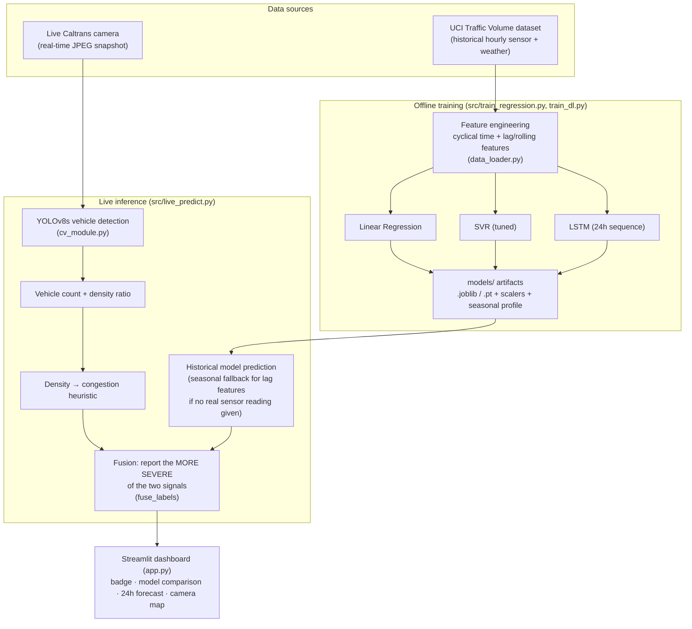

# Smart Traffic Congestion Prediction

Predicts road congestion by combining historical time/weather/recent-volume
patterns with live computer-vision vehicle counts from real public traffic
cameras. Three modeling techniques (Linear Regression, SVR, LSTM) are trained
on historical sensor data; a YOLOv8s detector reads live camera frames; the
two are fused into a single Low/Moderate/High/Severe congestion estimate,
all wrapped in a Streamlit dashboard.

- **Live app**: `streamlit run app.py` → http://localhost:8501
- **Repo**: [github.com/Rakesh-Tummala/traffic-congestion-prediction](https://github.com/Rakesh-Tummala/traffic-congestion-prediction)

---

## How to use the app

1. **Install & launch** (see [Setup](#setup) below), then run:
   ```bash
   streamlit run app.py
   ```
2. **Give it a camera frame** — pick one of three tabs under "1. Camera frame":
   - **Live Caltrans camera** (recommended): choose a district, optionally
     filter by route/location, then either **click a point directly on the
     map** or use the dropdown — the two stay in sync in either direction, and
     the selected camera is highlighted in red. Map points are also colored
     by their last-known congestion level from this install's history (gray
     = never checked yet). Click **Fetch live snapshot** to pull the current
     real image, **🌤️ Use real weather here** to auto-fill conditions below
     from this camera's actual location (free, no API key — see
     [below](#real-weather-live-auto-refresh-map-coloring-error-bands-and-reports)),
     or check **🔴 Auto-refresh** to keep re-fetching it on a timer.
   - **Upload image**: any traffic photo (JPG/PNG).
   - **Snapshot URL**: paste a direct image URL (any public traffic cam).
3. **Set conditions** — temperature, rain/snow, cloud cover, weather type,
   holiday flag. These feed the historical model; leave them at sensible
   defaults if you just want a quick look, or use the real-weather button above.
4. **Pick which model drives the forecast** — LSTM (most accurate, R²=0.977),
   SVR, or Linear Regression. All three run regardless; this just picks which
   one's label feeds the final fused result and the forecast chart.
5. *(Optional)* **Advanced panel** — if the camera's location has a real
   traffic volume sensor, enter its 1h/3h/24h-ago readings for a more accurate
   prediction than the default seasonal-average fallback.
6. **Read the result**:
   - A color-coded **congestion badge** (green→red) — the final answer.
   - The **detected-vehicles image** with bounding boxes drawn, plus an
     **⬇️ Download report** button that saves the frame and a summary panel
     as one shareable PNG.
   - **Vehicle count** and **image density ratio** from the live frame.
   - **All three models** compared side by side (predicted volume, R²,
     level) — not just the one you picked.
   - **⚠️ Unusual congestion detected** (when it fires) — shown when the live
     camera and the historical model disagree sharply (2+ severity levels
     apart, e.g. Low vs. High). A gap that large usually means something
     out of the ordinary is happening — an accident, event, or closure —
     rather than normal hour-to-hour variation, so it's flagged separately
     from the routine "camera vs. history" mismatches that `fuse_labels`
     already resolves silently by taking the worse signal.
   - **🔍 Why this prediction?** — a feature-level explanation. For Linear
     Regression this is exact: each feature's real coefficient × scaled
     value, so the contributions genuinely sum to the prediction. SVR and
     the LSTM aren't linearly decomposable, so for those (and shown as a
     labeled "deviation" explanation, not claimed as exact) it instead
     reports which inputs are most unusual right now compared to the
     historical training distribution — a proxy for "what's different about
     current conditions," honestly distinguished from the exact version so
     it's never mistaken for a true per-model attribution.
   - **📈 Recent history for this camera** — appears once at least two
     predictions have been logged for the same camera on this install; a
     simple trend chart of predicted volume over time. Logged once per fresh
     camera fetch (not on every slider tweak), stored locally and gitignored.
   - **Today's forecast** — predicted volume for every hour of the day, with
     the four congestion bands shaded, a shaded ± typical-error band around
     the line (this model's own held-out test-set MAE), and the current hour
     marked, so you can see whether right now is unusual for this time of day.
   - **🕒 When should I leave?** — pick a planned departure hour and how
     flexible you are (±1-6h); it checks that window against the forecast
     above and suggests a nearby hour with lower predicted congestion, if one
     exists — reusing the same forecast already computed, no separate model.
   - **Speed check (experimental)** — for a live Caltrans camera only (needs
     its video stream, not a static image): enter the lane width visible in
     the frame in pixels (real lane width defaults to the US standard
     3.7m), a speed limit, and click **Check speeds** to grab a short live
     video burst, track vehicles across it, and estimate each one's speed —
     flagging any more than 5mph over the limit. See
     [Speed estimation](#speed-estimation-experimental) below for how this
     works and its real limitations.
   - **What the fine would have been (simulated)** — for any vehicle Speed
     check flagged as speeding, pick it, optionally click **🔍 Try plate
     recognition** (real OCR — reads what it can, honestly reports "not
     readable" when it can't; see limitations below), edit/enter the vehicle
     number, and click **Generate summary** to see what the illustrative
     fine would have been. Purely informational — no real citation is
     issued and no fine is charged. See
     [e-Challan simulation](#e-challan-simulation-demo-only) below for
     exactly what this is and isn't.

There's also a **🗂️ Monitoring grid** tab (top-level, next to "🔍 Single
camera") for checking several cameras at once: pick a district, how many
cameras to check (1-16), optional shared weather assumptions, and hit
**Load grid** — each camera gets its own live detection, annotated
thumbnail, and congestion badge, plus a summary count of how many are
Low/Moderate/High/Severe.

And a **🛣️ Route** tab for checking several specific cameras together as one
route/corridor: pick a district, select 2+ cameras (any order — this is a
set, not a strict path), set shared weather assumptions, and hit **Check
route**. The overall route reading is always the worst of its segments (the
same max-severity idea `fuse_labels` uses for one camera, extended across
several), so a single jammed stretch is never hidden by an otherwise-clear
route — plus a segment-by-segment breakdown showing which camera is driving
that result.

Command-line equivalents (no dashboard) are documented further down under
[Run computer vision on a single frame](#run-computer-vision-on-a-single-frame)
and [Fused live prediction (CLI)](#fused-live-prediction-cli).

---

## Tech stack

| Layer                  | Technology |
|------------------------|------------|
| Language               | Python 3.11 |
| Classical ML           | scikit-learn — `LinearRegression`, `SVR` (rbf kernel, tuned via `RandomizedSearchCV` + `TimeSeriesSplit`), `StandardScaler` |
| Deep learning          | PyTorch — custom `TrafficLSTM` (2-layer LSTM + linear head), CPU inference |
| Computer vision        | Ultralytics **YOLOv8s** (pretrained on COCO) for vehicle detection, OpenCV for frame I/O and video capture |
| Speed estimation       | Custom nearest-centroid multi-frame tracker + pixel/time-to-speed conversion (`src/speed_estimation.py`), reading live HLS video via OpenCV |
| Data handling          | pandas, NumPy |
| Live camera data       | Caltrans public CCTV JSON feed (`cwwp2.dot.ca.gov`) via `requests` — no API key; per-camera HLS video streams for speed estimation |
| Dashboard              | Streamlit |
| Charts / visualization | Altair (24h forecast chart), pydeck (camera location map, click-to-select), Matplotlib/Seaborn (offline model-comparison chart) |
| Testing                | pytest (66 tests: fusion/anomaly/departure logic, explainability, prediction history, real-weather mapping, report generation, feature pipeline, live inference, speed-tracking math, e-challan logic, ANPR, vehicle color/type) |
| License plate OCR      | EasyOCR (`src/anpr.py`) — optional, on the selected vehicle's crop only, clearly marked as unverified |
| Vehicle color/type ID  | HSV-filtered k-means (color) + zero-shot CLIP (`openai/clip-vit-base-patch32`, body type), `src/vehicle_attributes.py` — best-effort, confidence shown |
| Simulated citation demo | `src/echallan.py` — illustrative fine schedule, informational "would have been" framing, local JSON log |
| Explainability          | `src/explain.py` — exact coefficient breakdown for Linear Regression, training-distribution deviation (z-score) proxy for SVR/LSTM |
| Prediction history      | `src/prediction_log.py` — local, gitignored JSON log of predictions per camera, powering the "Recent history" trend chart and the map's congestion coloring |
| Real weather            | `src/weather.py` — Open-Meteo (free, no API key), fetched from the selected camera's real coordinates |
| Downloadable report     | `src/report.py` — composes the annotated frame + a summary panel into a single PNG |
| Model persistence      | joblib (sklearn models + scalers), native PyTorch `state_dict` (LSTM) |
| Training dataset       | [UCI Metro Interstate Traffic Volume](https://archive.ics.uci.edu/dataset/492/metro+interstate+traffic+volume) (48,204 hourly readings, 2012–2018) |
| Version control        | Git, hosted on GitHub |

---

## System design



**Why fusion takes the max, not a blend**: the historical model and the live
camera are independent signals with no shared ground truth to learn a
combining weight from. An earlier multiplicative blend let a real
gridlocked-highway test photo get reported as "Low" congestion because the
historical baseline drowned out the live signal. Taking whichever label is
more severe is simple, transparent, and appropriate for a warning system —
see [Fusion design](#fusion-design-cv--historical-model) for the full story.

**Why the LSTM needs special handling for live inference**: it was trained on
24-hour sequences, so a single live snapshot in time isn't enough input on
its own. `live_predict.predict_lstm_volume` builds a synthetic 24-hour
feature sequence the same way the lag-feature fallback works (seasonal
average per hour, or real sensor readings if supplied) and feeds that
through the trained model.

---

## Model quality

| Model               | MAE    | RMSE   | R²    |
|---------------------|-------:|-------:|------:|
| Linear Regression   | 334.2  | 451.9  | 0.948 |
| SVR (tuned rbf)     | 253.5  | 397.5  | 0.960 |
| LSTM (24h lookback) | ~200   | ~295   | ~0.977 |

(LSTM numbers vary slightly run-to-run from random weight init and early-stopping timing.)

(Regenerate with `cd src && python evaluate.py` — trains all three and writes
`models/model_comparison.png`.)

Two things drove the biggest accuracy gains over an initial time+weather-only
baseline (which capped LR/SVR at R²≈0.71–0.77):

1. **Cyclical time encoding** — `hour`/`day_of_week`/`month` as sin/cos pairs
   instead of raw integers, so hour 23 and hour 0 are correctly "close" to a
   linear model.
2. **Lag/rolling features** — `lag_1h`, `lag_3h`, `lag_24h`, `rolling_mean_3h`
   computed from the sensor's own recent history. This is the single biggest
   lever (LR: 0.71 → 0.95, SVR: 0.77 → 0.96) and is what let LR/SVR compete
   with the LSTM's implicit 24h lookback. Computed via a continuous-hourly
   reindex + interpolation so a lag next to one of the dataset's real gaps
   (~6.5% of hours) still estimates the true value 1h prior, not whatever
   the previous *row* happened to be (`data_loader.add_lag_features`).

SVR's hyperparameters (`C=100, epsilon=10, gamma='auto'`) were chosen via
`RandomizedSearchCV` with `TimeSeriesSplit` cross-validation over a 4000-row
subsample — see `notebooks/tune_svr.py`.

## Fusion design (CV ↔ historical model)

The regression/LSTM models are trained on historical sensor data; the CV
model detects vehicles independently and maps its density ratio to a
Low/Moderate/High/Severe label via fixed thresholds. No public dataset pairs
camera frames with this sensor's volume readings, so there's no ground truth
to *learn* a fusion weight from.

An earlier version nudged the model's historical baseline by a small
multiplicative factor based on the live density ratio. Testing against a real
gridlocked-highway photo exposed why that failed: the CV heuristic correctly
read "Severe" (density ratio 0.8), but the multiplicative nudge was too weak
to move the final label out of "Low" — the historical baseline simply
drowned out the live signal. The fusion now reports **whichever of the two
independent labels is more severe** — deliberately conservative, since
under-reporting congestion that's plainly visible on camera is a worse
failure mode than over-reporting it (`live_predict.fuse_labels`, covered by
`tests/test_fusion.py`).

When a real live volume sensor reading isn't available for the lag features
(the common case for a camera-only location), the model falls back to a
seasonal (hour, day-of-week) average fit on the training data
(`data_loader.seasonal_profile`, `live_predict.estimate_lag_features`). Pass
real readings via `--lag-1h/--lag-3h/--lag-24h` (CLI) or the "Advanced" panel
(dashboard) when a sensor is present — this is strictly more accurate.

## Live camera integration

`src/live_cameras.py` browses Caltrans's public CCTV network — real,
currently in-service cameras, no API key required
([cwwp2.dot.ca.gov](https://cwwp2.dot.ca.gov/documentation/cctv/cctv.htm): "There is no
charge for the use of this data"). Covers all 12 Caltrans districts; district
7 (LA) alone has ~480 in-service cameras. The dashboard's "Live Caltrans
camera" tab lists and fetches from these directly.

```bash
cd src
python live_cameras.py 7 --search "I-5" --limit 10   # list LA-area I-5 cameras
```

No equivalent official, no-signup Indian (or other-country) public camera
feed was found during development — third-party "aggregator" sites that
claim thousands of live cameras typically index feeds without clear
authorization from camera owners, unlike Caltrans which is the state DOT
publishing its own data with an explicit public-use policy, so none of those
were integrated. The **Upload image** / **Snapshot URL** tabs work with any
traffic photo or image URL regardless of country.

**Known limitation, verified against a real live nighttime frame**: a
generic COCO-pretrained YOLO struggles on these cameras' low-resolution
(~320×260), often-nighttime images — 0 vehicles detected on a real frame with
visible cars. Tried and rejected three fixes during development: lowering the
confidence threshold (produced false positives in the wrong location, not
better recall), upscaling the frame, and CLAHE contrast enhancement (amplified
sensor noise instead of revealing detail). The fusion logic tolerates this
gracefully — when CV under-detects, the historical model's seasonal/lag-based
estimate still drives the final label — but real accuracy improvement here
would need either higher-resolution daytime-oriented cameras or a detector
fine-tuned on low-light traffic imagery (future work).

The CV density heuristic also reads occupancy purely from bounding-box area,
so an extreme close-up of a single vehicle can misread as "Severe" the same
as a genuinely packed road — not an issue for its intended input (a
roadside/overhead camera with a fixed wide field of view), but worth noting.
Occasionally a fetched camera returns Caltrans's own "Temporarily
Unavailable" placeholder image (a real camera outage on their end); the
pipeline still runs on it without crashing, it just correctly finds 0
vehicles.

**A genuinely tricky bug, for anyone extending the map**: the click-to-select
map (`app.camera_picker_map`) initially didn't register clicks at all, even
though panning and zoom-scrolling worked fine on the same canvas — proving
mouse events *were* reaching deck.gl, just not triggering its picking
(hit-test) path specifically. Isolating it took a from-scratch minimal
`st.pydeck_chart` repro matching Streamlit's own documented example, which
worked, then diffing that against this app's version piece by piece. The
cause: `get_fill_color`/`get_radius` referencing **per-row DataFrame
columns** (`get_fill_color=["r","g","b","a"]`, one row highlighted red to
show the current selection) silently breaks picking — the layer still
renders correctly, but click events never populate a selection. Switching
those two accessors to **static, non-per-row values** fixed it immediately.
The selected-camera highlight is instead drawn with a second, separate
single-row `ScatterplotLayer` on top (`pickable=False`) — visually
equivalent, but keeps the pickable layer's accessors fully static.

---

## Speed estimation (experimental)

`src/speed_estimation.py` estimates vehicle speed and flags speeding
relative to a posted limit, from a live camera's actual **video stream**
(HLS `.m3u8`, also published in Caltrans's feed alongside the static
snapshot) rather than the snapshot used everywhere else in this project.
That distinction matters: the snapshot only refreshes ~once a minute, so
two "live" fetches a few seconds apart just return the same cached image —
there's no motion to measure at all without switching to real video.

**Pipeline**: grab a short burst of frames (`capture_frame_burst`), run
YOLOv8s detection on each one (`detect_vehicles`), match detections between
consecutive frames with a simple nearest-centroid tracker
(`track_across_frames`), then convert each track's pixel displacement over
time into a real-world speed (`estimate_speed_mps`) using a user-supplied
meters-per-pixel scale, and compare against the posted limit with a margin
to absorb noise (`flag_speeding`).

**Two things had to be fixed to make this work at all, both confirmed by
direct testing**:

1. **Frame timing**: an HLS source can hand over an already-buffered
   segment far faster than real time — a ~1.5s burst of video was read in
   under 20ms of wall-clock time during testing. Timing frames by
   `time.time()` between reads would have overestimated every speed by
   ~75x. Frames are timestamped from the stream's own internal clock
   (`cv2.CAP_PROP_POS_MSEC`) instead, which tracks the footage's real
   elapsed time regardless of how fast it's downloaded.
2. **Calibration**: there is no published camera calibration for any of
   these cameras, so pixel displacement can't be converted to real-world
   distance automatically. Rather than guess, the app asks for a lane
   width in pixels (measured by eye on the displayed frame) and a real
   lane width in meters (defaults to the US standard 3.7m) and derives
   meters-per-pixel from that ratio. This is an approximation the user
   controls, not an automatic measurement — treat resulting speeds
   accordingly, not as a certified reading.

**Known limitations**: the tracker is deliberately simple — greedy
nearest-centroid matching with no re-identification after a missed frame
and no handling of vehicles crossing paths, adequate for a short burst with
a handful of well-separated cars but not for dense, fast-crossing traffic.
It inherits the same low-light detection limitation as the rest of the
project (verified: a dim/empty-looking camera can track zero vehicles even
when cars are technically present — a well-lit, busier camera works much
better, as confirmed during development). And because live traffic is
genuinely dynamic, results vary run to run on the same camera — sometimes
zero vehicles are trackable, sometimes several.

**Not every camera with a working snapshot has a working video stream**:
confirmed against a real camera during use — "I-5 (14) SB 5 to WB 10 CONN"
is marked in-service and its snapshot loads fine, but its stream URL
returns a 404. Caltrans's `inService` flag apparently reflects the
snapshot system, not necessarily the separate streaming backend, and the
two aren't always in sync. Two things guard against this: the error is
caught and reported clearly rather than crashing (pick a different camera
and try again), and `capture_frame_burst` runs under a hard timeout in a
worker thread — a dead stream that hangs at the connection level rather
than failing fast (confirmed: some do) can't block the app indefinitely,
even though OpenCV's own configurable timeout properties turned out not to
reliably fire for every failure mode during testing.

```bash
cd src
python speed_estimation.py "<stream .m3u8 URL>" --lane-width-px 40 --limit-mph 65 --save-annotated out.jpg
```

---

## e-Challan simulation (demo only)

`src/echallan.py` shows what an illustrative fine **would have been** for a
vehicle Speed check flagged as speeding, styled after India's e-challan
system (the public term for an electronic traffic fine). This exists purely
to demonstrate how a detection pipeline could feed into a citation
workflow — **no real citation is issued and no fine is charged. It is not
connected to any government system, vehicle registry, or payment
processor.** Every generated summary carries a prominent disclaimer banner
saying exactly this, and the wording throughout ("fine that would have
applied ... not charged") is deliberately informational rather than
looking like a real, actionable document.

**Optional automatic license plate recognition** (`src/anpr.py`, via
EasyOCR — pure Python, no external OCR binary needed): click **🔍 Try plate
recognition** to attempt reading the selected vehicle's plate from the live
frame; the result (or an honest "couldn't read it" if OCR found nothing
confident) prefills the editable vehicle-number field, clearly marked as
auto-detected with its confidence so it's never mistaken for a verified
reading. **Verified real-world limitation**: on this project's actual live
camera footage, plates are frequently illegible or not visible at all —
nighttime footage is too blurry/low-light, and even in a clear daytime
traffic photo, most vehicles' rear plates are occluded by neighboring
vehicles or captured from an angle that doesn't show the plate. A synthetic
clear-text sanity check confirms the OCR mechanism itself works correctly
(occasionally confusing visually similar characters like 0/O — a known,
generic OCR limitation, not a bug here); real footage returning "not
readable" is the expected common case, not a malfunction. See
`tests/test_anpr.py`.

The illustrative fine amounts reference India's Motor Vehicles (Amendment)
Act, 2019, Section 183 (public law that does set over-speeding penalties),
scaled by vehicle class (two-wheeler/car vs. bus/truck) and whether the
vehicle was more than 20mph over the limit — but the actual amount, the
"aggravated" threshold, and applicability are illustrative choices for this
demo, not a real legal determination.

`generate_challan` refuses to run on a vehicle that wasn't actually flagged
as speeding (raises `ValueError`) — a summary should never be generated for
a non-violation, even in a simulation. Issued (simulated) records are logged
locally to `models/echallan_log.json` (gitignored, not committed) so the
dashboard's "Challan history" can show what's been generated during that
install; nothing is sent anywhere, and no plate text is retained beyond
this local file. No standalone CLI — it's driven from the dashboard's Speed
check results; see `tests/test_echallan.py` and `tests/test_anpr.py` for
direct usage of the underlying functions.

---

## Vehicle color & body type (best-effort, demo only)

`src/vehicle_attributes.py` adds a **🎨 Identify vehicle color & type**
button to the Speed check results table, showing a best-effort color and
body-style guess for each tracked vehicle alongside its speed:

- **Color** is read as the dominant paint color from the vehicle's bounding
  box: pixels are clustered by color (k-means) after filtering out very
  dark pixels (shadows, tinted glass, tires) and very bright pixels
  (glare/reflections), which otherwise dominate a naive clustering and
  produce the wrong color — verified against a real daytime SUV crop, where
  clustering all pixels picked a dark window/tire gray while the filtered
  version correctly picked the actual white body paint.
- **Body type** (sedan / SUV / pickup truck / hatchback / minivan / bus /
  truck / motorcycle) comes from a zero-shot pass through CLIP
  (`openai/clip-vit-base-patch32`), matching the vehicle crop against a
  fixed list of body-style text prompts. CLIP is a general-purpose
  image/text model, not trained on traffic cameras, so this is a guess with
  a confidence score shown alongside it (verified manually on real daytime
  crops: correct but only ~30-55% confidence; expect it to do worse on
  small or nighttime crops), not a reliable classification.
- **No make/model identification** (e.g. "Toyota Camry") is included: at
  the resolution these public traffic cameras deliver, badges and grille
  details aren't legible, and guessing a specific make/model from body
  shape alone would be more misleading than useful for a project meant to
  demonstrate a pipeline, not fabricate a confident-looking wrong answer.

Results are cached per speed-check run in session state so re-rendering the
table doesn't re-run the model. See `tests/test_vehicle_attributes.py`.

---

## Anomaly detection, explainability, history, and route congestion

Five smaller features layered on top of the core fusion pipeline — each
reuses signals the app already computes rather than adding a new model:

- **Anomaly / incident flag** (`detect_anomaly` in `src/live_predict.py`) —
  `fuse_labels` already resolves small camera-vs-history disagreements by
  trusting the worse one; a *large* disagreement (2+ severity levels, e.g.
  Low vs. High) is different in kind, not just degree — it usually means
  something happened that the historical model has no way to know about
  (an accident, an event, a closure). That gets its own warning banner
  instead of silently folding into the routine fusion.
- **"Why this prediction?"** (`src/explain.py`) — Linear Regression is
  linearly decomposable, so its explanation is exact: each feature's real
  coefficient × scaled value, and those contributions genuinely sum to the
  prediction. SVR (RBF kernel) and the LSTM are not linearly decomposable,
  so for those the app instead reports which inputs are most unusual right
  now versus the historical training distribution (a z-score). That
  baseline is computed on a **winsorized** copy of the training data — this
  dataset has a known data-quality outlier (`rain_1h` includes one row
  logging 9831mm of rain in a single hour, obviously a sensor/logging
  error) that otherwise inflates the raw standard deviation enough to make
  a genuine 50mm downpour look barely unusual. The UI always labels which
  kind of explanation it's showing rather than presenting the deviation
  proxy as if it were an exact attribution.
- **Recent history for this camera** (`src/prediction_log.py`) — every
  fresh camera fetch (not every slider tweak) is logged locally to a
  gitignored JSON file, and once a camera has 2+ logged predictions the
  dashboard shows a simple trend chart. It's a local convenience log for
  this install, not a real telemetry pipeline.
- **"When should I leave?"** (`recommend_departure` in
  `src/live_predict.py`) — reuses the same 24h forecast already shown to
  the user: given a planned departure hour and a flexibility window, it
  checks nearby hours and suggests one with lower predicted congestion, if
  one exists. No new model — just a different read of an existing forecast.
- **🛣️ Route tab** — combine 2+ cameras into one reading using the same
  max-severity idea `fuse_labels` uses for a single camera, extended across
  several: the overall route congestion is always the worst segment, with a
  per-camera breakdown showing which one is driving that result.

See `tests/test_fusion.py` (anomaly + departure), `tests/test_explain.py`,
and `tests/test_prediction_log.py`.

---

## Real weather, live auto-refresh, map coloring, error bands, and reports

Five more features, all built from data the app already has access to —
no new external services beyond one free weather API:

- **🌤️ Use real weather here** (`src/weather.py`) — fetches the selected
  camera's actual current conditions from Open-Meteo (free, no API key)
  using its real latitude/longitude, and auto-fills the temperature, rain,
  snow, cloud cover, and weather-type inputs instead of requiring manual
  entry. Every field is clamped to that widget's valid range and cast to
  its declared type before being written into `st.session_state`, since
  Streamlit raises if a pre-set value falls outside a slider's bounds or
  mixes int/float with what the widget expects.
- **🔴 Auto-refresh** — keeps re-fetching the selected live camera on a
  timer (10-120s, adjustable) using `st.fragment(run_every=...)`, so the
  view updates on its own instead of requiring a manual re-click. An
  earlier version of this used a manual `time.sleep()` + `st.rerun()` poll
  loop instead; that blocked the whole session's script thread while
  waiting, which starved the browser's own health-check connection and
  made the UI intermittently flash "Is Streamlit still running?" —
  confirmed via live testing, and the reason this uses `st.fragment`
  instead, which reruns independently without blocking anything else.
  Detection and prediction on ticks that don't fetch a new frame are cheap
  because `analyze_frame`/`predict_all_models` are wrapped in
  `st.cache_data`, so an unchanged frame doesn't re-run YOLO or the model.
- **Congestion-colored map** — the same clickable camera map now colors
  each point by its last-known congestion level from the local prediction
  history (gray = never checked yet on this install), via a second,
  non-pickable pydeck layer drawn under the existing click-target layer —
  per-row colors are what broke click-picking on the *pickable* layer in
  earlier testing, but that finding doesn't apply to a layer that's never
  meant to be clicked.
- **Forecast error band** (`MODEL_MAE` in `app.py`) — the 24h forecast
  chart now shades ± each model's own held-out test-set MAE around the
  line, instead of implying the forecast is exact. MAE was computed once
  from the already-trained model artifacts (no retraining): 334.2 (Linear
  Regression), 253.5 (SVR), 202.6 (LSTM) vehicles/hour.
- **⬇️ Download report** (`src/report.py`) — composes the current camera's
  annotated frame plus a summary panel (congestion level, vehicle count,
  timestamp) into a single downloadable PNG, for sharing one specific
  result without opening the dashboard.

See `tests/test_weather.py` and `tests/test_report.py`.

---

## Setup

```bash
python -m venv .venv
.venv\Scripts\activate          # Windows
pip install torch --index-url https://download.pytorch.org/whl/cpu   # CPU-only build
pip install -r requirements.txt
```

## Train

```bash
cd src
python train_regression.py      # Linear Regression + SVR -> models/
python train_dl.py              # LSTM -> models/
python evaluate.py              # trains everything, prints + plots comparison
```

## Test

```bash
python -m pytest tests/ -v
```

Covers the fusion logic (the "Low" bug and its fix), the data/feature
pipeline (lag correlation, cyclical encoding, no missing values), and the
live-inference path (all three models return sane predictions, a real
sensor reading actually changes the output vs. the seasonal fallback).

## Run computer vision on a single frame

```bash
cd src
python cv_module.py path/to/image.jpg --save annotated.jpg
python cv_module.py https://example-dot-traffic-cam.gov/snapshot.jpg
python cv_module.py 0            # webcam
```

## Fused live prediction (CLI)

```bash
cd src
python live_predict.py path/to/image.jpg --weather-main Clear --temp-c 22 --model lstm
# with a real sensor reading, if this location has one:
python live_predict.py path/to/image.jpg --lag-1h 5200 --lag-3h 4900 --lag-24h 5000
```

## Project structure

```
data/                UCI traffic dataset
models/               trained model artifacts (.joblib, .pt) + comparison chart
notebooks/
  tune_svr.py         one-off SVR hyperparameter search (RandomizedSearchCV)
src/
  data_loader.py      dataset loading + feature engineering (cyclical time, weather, lag features)
  train_regression.py Linear Regression + SVR (+ seasonal_profile for live fallback)
  train_dl.py         LSTM (PyTorch), validation-based early stopping
  cv_module.py        YOLOv8s vehicle detection/counting
  live_cameras.py     browse/fetch real public Caltrans CCTV camera snapshots + stream URLs
  live_predict.py     fuses CV output + trained models -> congestion label; anomaly flag + departure recommendation
  speed_estimation.py multi-frame vehicle tracking + speed estimation from live video
  anpr.py             optional license plate OCR (EasyOCR) on a vehicle's cropped region
  echallan.py         simulated "fine would have been" summary generator
  vehicle_attributes.py  best-effort color (k-means) + body type (CLIP) identification
  explain.py          per-prediction explanation (exact for Linear Regression, deviation-based for SVR/LSTM)
  prediction_log.py   local per-camera prediction history log, powers the trend chart + map coloring
  weather.py          real current weather for a camera's coordinates via Open-Meteo (free, no API key)
  report.py           composes an annotated frame + summary panel into a downloadable PNG
  evaluate.py         trains all 3 models, prints/plots MAE/RMSE/R2 comparison
tests/                pytest suite (fusion/anomaly/departure, explainability, prediction history, real weather,
                      report generation, data pipeline, live inference, speed math, e-challan, ANPR, vehicle attrs)
app.py                Streamlit dashboard
```
